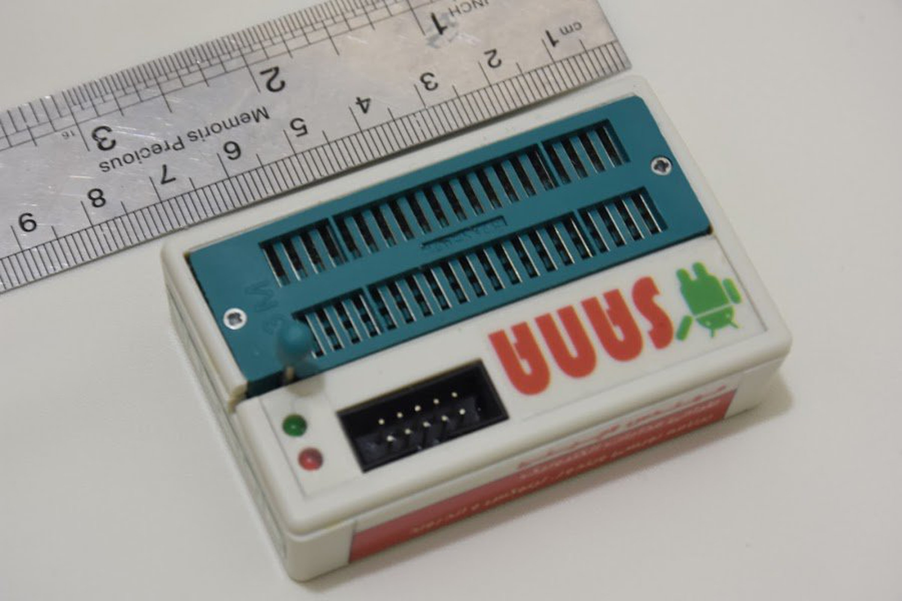
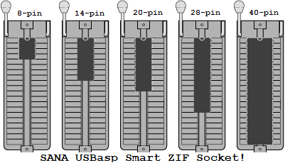
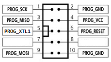

# SANA USBasp – Smart ZIF-Socket AVR Programmer



A compact, USB-powered AVR programmer with an integrated **40-pin ZIF socket** and **auto-wiring** logic. It speaks the standard **USBasp** protocol, so it works out-of-the-box with `avrdude` on **Linux / Windows / macOS** — and even **Android** (OTG) via ZFlasher AVR.

> **Credit & Origin**  
> This project is **based on the original USBasp** by **Thomas Fischl** (the excellent reference design and idea). See: https://www.fischl.de/usbasp/  
> SANA USBasp extends that design with a smart ZIF socket, auto-detect wiring, on-board clock injection, status LEDs, **I²C/SPI EEPROM programming**, and more (details below).

---

## Highlights

- **Smart 40-pin ZIF socket** with **auto-detect package & wiring**  
  Drop any **DIP 8/14/20/28/40** AVR **starting at pin-1** in the ZIF — the programmer **detects the device position automatically** and routes all signals you need:
  `VCC`, `GND`, `RESET`, `SCK`, `MOSI`, `MISO`, and even an **external clock** to the MCU’s `XTAL1` pin when needed.  
  No jumpers, no DIP-switches, no relocating the chip for different packages.

- **Fuse-proof clock injection**  
  If fuses were set for an external clock/oscillator (and your chip “bricked” due to a disabled internal RC), SANA will **supply the clock** so you can program it again.

- **IDC-10 ISP header with clock out**  
  The 10-pin IDC connector also provides a **clock output** for in-circuit programming (**ISP**) on boards where the target oscillator isn’t running.

- **Driver-state indicator (Windows)**  
  Red LED stays on when the driver isn’t installed; once the USBasp driver is correctly installed, the **green LED** indicates proper enumeration.

- **I²C/SPI EEPROM programmer**  
  Supports popular serial EEPROM families: **24Cxxx** (I²C) and **93Cxx** (Microwire/SPI-like). You can read/write/verify these EEPROMs directly in the ZIF socket.  
  On **Windows**, the **ProgISP** utility provides a convenient GUI for these memories.

- **Pocket-size** — basically the footprint of a 40-pin ZIF; truly **grab-and-go**.

- **USB-powered** (5 V from the host).

- **Fully USBasp-compatible**  
  Works with `avrdude` and common GUI front-ends across Linux/Windows/macOS — plus **Android** via **ZFlasher AVR**.

- **Field-proven**  
  Used by customers in the **USA**, **Italy**, and **Netherlands**.



### IDC-10 ISP Header Pinout (SANA)

When programming targets in-circuit, use the **10-pin IDC** header. It also carries the **rescue clock** (`PROG_XTL1`) to keep “fuse-bricked” MCUs alive during programming.

> ⚠️ **Cautions**  
> • If your target board is self-powered, **do not connect PROG_VCC** (Pin 4).  
> • Always verify **keying/orientation** (Pin-1) before plugging the cable.  
> • For EEPROMs, ensure the device capacity matches the operation and that any **WP** (write-protect) pins are not asserted.  
> • If your target isn’t 5 V tolerant, use proper **level shifting** and power arrangements.

| Pin | Signal      | Notes                                           |
|:---:|-------------|--------------------------------------------------|
| 1   | PROG_SCK    | SPI clock                                        |
| 2   | PROG_GND    | Ground                                           |
| 3   | PROG_MISO   | MCU → Programmer                                  |
| 4   | PROG_VCC    | **Optional** target power (disconnect if self-powered) |
| 5   | PROG_XTL1   | **Clock injection** to target `XTAL1`            |
| 6   | PROG_RESET  | Target reset                                     |
| 7   | —           | Not connected                                    |
| 8   | —           | Not connected                                    |
| 9   | PROG_MOSI   | Programmer → MCU                                  |
| 10  | PROG_GND    | Ground                                           |



---

## Repository Contents

- Firmware (ATmega88, V-USB/`usbdrv` based)
- Makefile with a friendly `help` target and robust tooling
- Source tree: `I2C/`, `Zif_Socket/`, `usbdrv/`, etc.
- Build artifacts are generated **outside** the source tree by default  
  → `../build/SANA_UsbAsp/…`

---

## Build From Source

### Prerequisites

- **Linux (Debian/Ubuntu):**
  ```bash
  sudo apt update
  sudo apt install -y build-essential gcc-avr avr-libc avrdude zip tar
  ```
- **macOS (Homebrew):**
  ```bash
  brew update
  brew tap osx-cross/avr
  brew install avr-gcc avrdude
  ```
- **Windows:**
  - Use **WSL** (Ubuntu) with the Linux commands above, or
  - Install an AVR toolchain (e.g., MSYS2/WinAVR) and `avrdude`.
  - Install the **USBasp driver** (e.g., via Zadig). The device’s **LEDs** will help: red → driver missing, green → OK.

### Get the code & build

```bash
git clone git@github.com:HosseinLachini/zifasp.git
cd zifasp/SANA_USBASP
# Show usage and current configuration
make

# Build everything (ELF, HEX, BIN, MAP + archives)
make all
```

**Outputs** (by default):  
`../build/SANA_UsbAsp/{SANA_UsbAsp.elf,.hex,.bin,.map,.zip,.tar.gz}`

> You can change the output root with `OUT_BASE`:
> ```bash
> make OUT_BASE=/abs/path/to/build all
> ```

### Helpful Make targets

```text
make               -> same as 'make help'
make help          -> show help & current variables
make all           -> build ELF/HEX/BIN (+ zip/tar.gz)
make main.hex      -> ensure HEX exists
make disasm        -> generate .lst from ELF
make clean         -> remove build directory
```

---

## Flashing the Firmware (to the ATmega88 on SANA)

With the device connected as a USBasp:

```bash
# Adjust -p if you change MCU; defaults target the ATmega88 (m88)
avrdude -c usbasp -p m88 -U flash:w:../build/SANA_UsbAsp/SANA_UsbAsp.hex:i
```

**Fuse caution:** only program fuses if you know what you’re doing. The Makefile provides helpers:

```bash
# Read fuses
make fuses-read

# Write fuses (example values)
make fuses-write LFUSE=0xEF HFUSE=0xC9   # (set values appropriate to your setup)
```

---

## Using the Programmer

1. **Standalone with ZIF socket (DIP packages)**  
   - Lift the lever, insert the AVR **starting at pin-1** (see figure), lower the lever.  
   - SANA auto-detects the package/position and internally routes `VCC/GND/RESET/SCK/MOSI/MISO`.  
   - If the target requires an **external clock** (due to fuses), SANA injects clock on `XTAL1`.

2. **In-System Programming (ISP) via IDC-10**  
   - Connect the **10-pin IDC** cable to the target.  
   - SANA also provides a **clock output** on the IDC header to revive targets with disabled oscillators.

3. **Serial EEPROMs (24Cxxx / 93Cxx)**  
   - Place the EEPROM in the ZIF starting at **pin‑1**.  
   - For **24Cxxx (I²C)** parts, SANA routes `SDA/SCL` and powers the device; for **93Cxx** parts, it routes `DO/DI/CLK/CS`.  
   - On **Windows**, you can use **ProgISP** for a simple GUI workflow to read/write/verify these EEPROMs. Other platforms can use command‑line tools or custom scripts.

4. **Host platforms**  
   - **Linux / macOS / Windows**: use `avrdude -c usbasp -p <part> ...` for AVR MCUs.  
   - **Android**: use **ZFlasher AVR** (Google Play):  
     https://play.google.com/store/apps/details?id=ru.zdevs.zflasheravr&hl=en

5. **LEDs (Windows driver hint)**  
   - **Red LED** steady: driver not installed.  
   - **Green LED**: device enumerated with correct driver.

> Power is drawn entirely from **USB**. If your target board isn’t 5 V-tolerant, use proper level shifting and power arrangements.

---

## Compatibility

- AVR DIP packages up to **40-pin** (e.g., ATmega8/88/168/328(P), ATmega16/32, many ATtiny devices, etc.).  
- Serial EEPROM families **24Cxxx** and **93Cxx** in DIP packages.  
- Fully compatible with the **USBasp** protocol (works wherever USBasp works).

---

## Screens & Size

- See **ruler photo** above for the overall external dimensions — the enclosure is only slightly larger than the 40-pin ZIF, making it truly pocketable.

---

## Support, Credits & Links

- **Original USBasp** by **Thomas Fischl** (primary idea & base design): https://www.fischl.de/usbasp/  
- **Project website (author):** https://www.elewiz.com/  
- **LinkedIn (author):** https://www.linkedin.com/in/hossein-lachini/

If you build or use this programmer, I’d love to hear from you — it’s already in the hands of users in the **USA**, **Italy**, and **Netherlands**.

---

## Troubleshooting

- `make`: prints usage if you forget a target; `make all` builds everything.  
- If `avrdude` can’t detect the device on Windows, install the USBasp driver; the **LEDs** indicate the state (red → missing driver, green → OK).  
- If a target MCU doesn’t respond due to fuse settings, try programming it in the **ZIF socket** (clock injection) or via ISP with the SANA clock output.  
- For EEPROMs, ensure the device capacity matches the operation and that WP pins (if any) are not asserted.

---

## License

This work builds upon and credits the original USBasp by Thomas Fischl.  
Please consult the repository for the exact firmware/license terms for SANA USBasp and any third-party components (e.g., V-USB/usbdrv).
